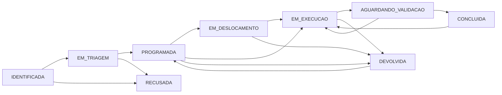

# API REST

Base `/api`. Corpos JSON, exceto anexos multipart. Sessão pelo cookie `urban_session` retornado no login. Erros: `{ "error": "mensagem", "details": ... }`. Códigos usuais: 400 validação, 401 sessão, 403 permissão, 404 registro ausente, 409 conflito, 429 limite de login, 500 falha interna.

## Fluxo canônico

Os estados e transições estão centralizados em `server/domain/workflow.js`. `IDENTIFICADA`, `EM_TRIAGEM` e `RECUSADA` são decisões da ocorrência. `PROGRAMADA`, `EM_DESLOCAMENTO`, `EM_EXECUCAO`, `AGUARDANDO_VALIDACAO`, `DEVOLVIDA`, `CONCLUIDA` e `CANCELADA` pertencem à OS; ocorrências vinculadas refletem o status da OS. Uma transição inválida retorna conflito e não altera registros.



| Método | Rota | Função |
| --- | --- | --- |
| POST | /auth/login | `{email,password}` |
| GET | /auth/me | Usuário autenticado |
| POST | /auth/logout | Encerra sessão |
| GET | /bootstrap | Usuário, catálogos, regras e configuração |
| GET / POST | /ocorrencias | Listar / cadastrar |
| GET / PATCH | /ocorrencias/:id | Detalhe / classificar em triagem |
| GET | /ocorrencias/proximas?lat=&lng= | Registros no raio configurado |
| POST | /ocorrencias/:id/classificar | Categoria, subcategoria, setor, prioridade |
| POST | /ocorrencias/:id/recusar | `{reason}` obrigatório; apenas antes de programar, com permissão de triagem; registra `RECUSADA`, motivo, usuário, data, auditoria |
| POST | /ocorrencias/:id/encaminhar | Mesmo contrato da classificação |
| POST | /ocorrencias/:id/anexos | Arquivo da ocorrência |
| GET / POST | /ordens-servico | Listar / programar |
| GET | /ordens-servico/:id | Detalhe, ocorrências, evidências e consumo |
| POST | /ordens-servico/:id/assumir | Iniciar deslocamento |
| POST | /ordens-servico/:id/iniciar | `{lat,lng}` da chegada |
| POST | /ordens-servico/:id/material | `{material_id,quantity}` |
| POST | /ordens-servico/:id/equipamento | `{equipment_id}` |
| POST | /ordens-servico/:id/anexos | Arquivo da OS |
| POST | /ordens-servico/:id/concluir | `{notes}` da execução |
| POST | /ordens-servico/:id/validar | Validação fiscal |
| POST | /ordens-servico/:id/reabrir | `{reason}` |
| POST | /ordens-servico/:id/cancelar | `{reason}` |
| GET | /anexos/:id | Conteúdo autenticado do arquivo |
| GET | /mapa/ocorrencias | GeoJSON FeatureCollection |
| GET | /dashboard | Indicadores e dados agregados |
| GET / POST | /categorias, /setores, /equipes, /materiais, /equipamentos, /secretarias, /departamentos | Catálogos |
| PATCH | /{catalogo}/:id | Atualizar cadastro |
| GET / POST | /users | Administrador: listar/criar usuário |
| PATCH | /settings | `{municipality,duplicate_radius}` |
| GET | /auditoria | Administrador: últimos 300 eventos |

## Cadastro de ocorrência

```json
{
  "category_id": "category-1",
  "subcategory": "Buraco",
  "description": "Falha no pavimento junto ao cruzamento",
  "lat": -26.99,
  "lng": -48.64,
  "address": "Rua 1500, 300",
  "neighborhood": "Centro",
  "origin": "Fiscalização municipal",
  "priority": "Alta",
  "reference": "Próximo à faixa de pedestres"
}
```

`sector_id` é opcional na criação e assume o padrão da categoria. Se existir ocorrência ativa no raio, retorna 409 com `details.nearby`. Reenvie com `duplicate_action: "new"` para confirmar novo registro ou `duplicate_action: "link"` e `duplicate_id` para registrar uma solicitação relacionada. O vínculo preserva o ID da ocorrência existente.

Filtros na listagem e GeoJSON: `q`, `status`, `priority`, `category_id`, `sector_id`, `neighborhood`, `from`, `to` (datas no formato YYYY-MM-DD).

## Programar OS

```json
{
  "occurrence_ids": ["UUID da ocorrência em triagem"],
  "team_id": "team-1",
  "scheduled_at": "2026-09-15",
  "responsible": "João Santos",
  "notes": "Programação da equipe"
}
```

Todas as ocorrências e a equipe precisam pertencer ao mesmo setor. A categoria define o SLA por prioridade; o prazo é calculado pelo servidor.

## Evidências

Multipart com `file`, `stage`, `lat` e `lng`. Etapas: `registro`, `antes`, `durante`, `depois`, `documento`. JPG/PNG/WebP/PDF/MP4 até 15 MB. Fotos exigidas no fluxo devem ser arquivos de imagem, não PDFs. Coordenadas da evidência podem ser obtidas do dispositivo ou confirmadas manualmente.

## Catálogo de categoria

`name`, `subcategories` (array), `sector_id`, `sla` (objeto com Emergencial, Alta, Média, Baixa e Programada em horas), `require_before`, `require_after`, `require_material`. Campos não reconhecidos são descartados pela validação.

## Planejamento territorial

- `GET /api/planejamento`: grupos de ocorrências abertas por rua/bairro, prioridade sugerida e planos persistidos com progresso e OS relacionadas. Ordens de outras equipes permanecem ocultas para usuários de campo.
- `POST /api/planos-acao` (Administrador/Gestor): `{occurrence_ids: [id], objective, responsible, scheduled_at: "AAAA-MM-DD"}`. Aceita 1–100 ocorrências abertas da mesma rua/bairro e setor, sem vínculo prévio a plano; cria plano e auditoria em transação.
- `POST /api/ordens-servico` aceita `plan_id` opcional e valida pertencimento. A vinculação também é inferida dos registros, inclusive na criação individual de OS. Não permite misturar ocorrências de planos diferentes ou planejadas com não planejadas na mesma OS.

## Operação de campo

- `GET /api/campo`: ordens autorizadas com endereços, registros criados pelo usuário, horário do servidor e disponibilidade/chave pública de push.
- `POST /api/ocorrencias`: também permitido a Equipe de Campo; aceita `requested_by`, `phone` e UUID `request_id` opcional para reenvio idempotente.
- `POST /api/ocorrencias/:id/anexos` e `/api/ordens-servico/:id/anexos`: multipart aceita UUID `request_id`; reenvios retornam a mesma evidência. Operadores só anexam a ocorrências próprias ou a ordens que podem executar.
- `POST /api/ordens-servico`: aceita `assigned_user_id` opcional, restrito aos operadores da equipe. Registra emissor e enfileira aviso para os destinatários.
- `POST /api/ordens-servico/:id/programacao`: Administrador/Gestor; `{team_id, assigned_user_id?, responsible, scheduled_at, notes}`. Permitido para `PROGRAMADA` ou `DEVOLVIDA`.
- `POST /api/ordens-servico/:id/devolver`: executor autorizado; `{reason}` obrigatório. Retorna à gestão no estado `DEVOLVIDA`.
- `POST /api/campo/notificacoes`: cadastra assinatura Web Push `{endpoint,keys:{p256dh,auth}}`; requer configuração VAPID e endpoint de serviço de push reconhecido.
- `DELETE /api/campo/notificacoes`: `{endpoint}`; remove a assinatura do usuário naquele aparelho.
- `GET /healthz`: verificação de disponibilidade do processo, sem autenticação.

`/bootstrap` inclui `operators` (id/nome/equipe) apenas para perfis com permissão de programação. `validar`/`reabrir` também são permitidos a Gestor; continuam bloqueados para Equipe de Campo.

## Kanban compartilhado

- `GET /api/kanban`: retorna `{revision, limits, order}`; o bootstrap inclui a mesma configuração.
- `PATCH /api/kanban`: gestores/administradores enviam `{revision, limits}` com limites inteiros de 0 a 999 para etapas abertas. Zero desativa o limite.
- `POST /api/kanban/ordem`: triagem, gestão e fiscalização enviam `{revision, status, keys}` com todos os cartões da etapa em ordem, no formato `occurrence:id` ou `order:id`. Duplicados, conjuntos incompletos e revisões desatualizadas retornam 409.
- Movimentações usam as rotas operacionais existentes com `kanban_expected_status`. O servidor valida a etapa esperada, os requisitos da ação e os limites compartilhados antes do commit.

Os limites também se aplicam às outras telas. Consulte [uso do quadro](KANBAN.md).
