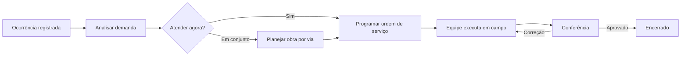
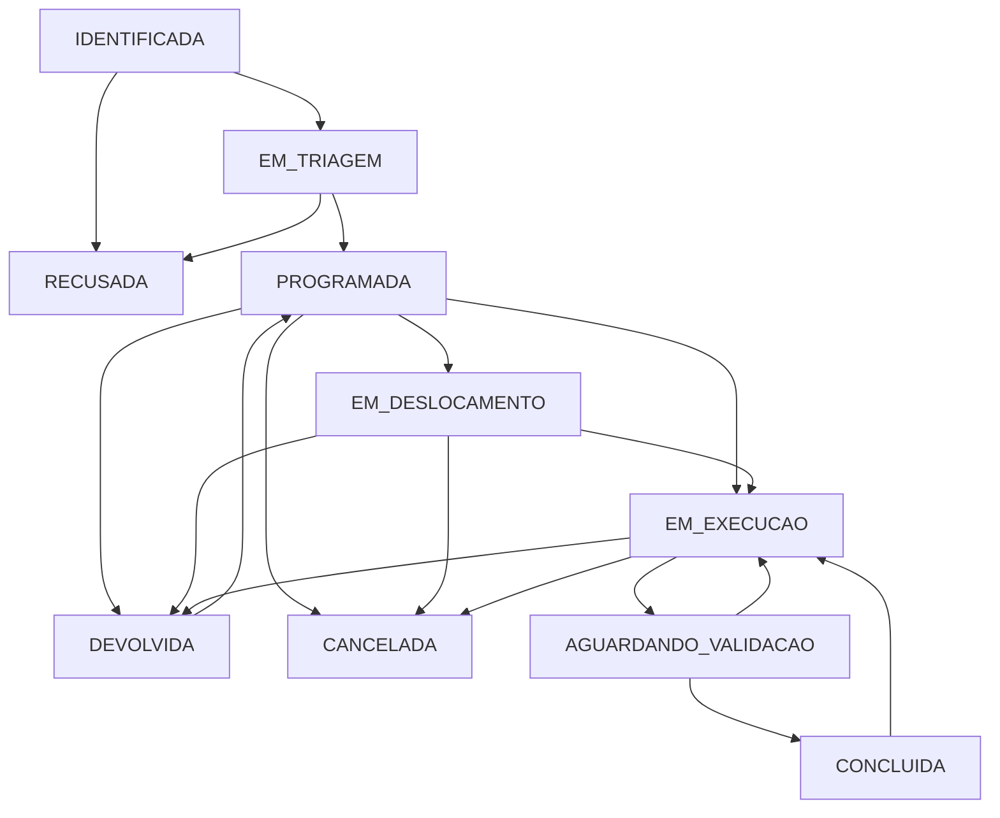

# Contexto do sistema Urbana

> Documento de referência para análise do produto e da operação. Atualizado em 2 de outubro de 2026, a partir da implementação atual.

## 1. O que é o sistema

O **Urbana** é um sistema web de gestão de manutenção municipal, com foco inicial em ocorrências de manutenção viária. Ele organiza o caminho entre a identificação de um problema na rua e a validação do serviço executado.

O sistema atende duas necessidades complementares:

- **Gestão:** receber demandas, analisar, priorizar, distribuir equipes, acompanhar prazos, materiais, evidências, custos e resultados.
- **Campo:** permitir que a equipe receba tarefas, use GPS e câmera, registre a execução, informe impedimentos e envie o resultado para conferência.

O sistema está configurado como MVP operacional. Os dados demonstrativos usam Balneário Camboriú apenas como referência geográfica; não representam a operação de um município real.

## 2. Problema que ele resolve

Antes da execução, uma demanda pode chegar incompleta, repetida, sem localização precisa ou sem prioridade definida. Depois, a gestão precisa decidir quem executa, quando, com quais recursos e como comprovar o resultado.

O Urbana cria rastreabilidade para essa cadeia: uma ocorrência representa o problema observado; uma ordem de serviço representa o atendimento planejado; evidências, materiais, equipamentos, histórico e validação registram o que aconteceu.

## 3. Princípios do fluxo atual

O caminho diário foi simplificado em quatro decisões visíveis na interface:

1. **Analisar demanda:** conferir categoria, subcategoria, prioridade e setor responsável.
2. **Programar atendimento:** escolher equipe, responsável e data para emitir uma ordem de serviço.
3. **Executar serviço:** registrar chegada, evidências, materiais, equipamentos e relato.
4. **Conferir e encerrar:** gestão ou fiscalização revisa o resultado e aprova ou pede correção.

O Planejamento é uma ferramenta de apoio, não uma etapa obrigatória: deve ser usado quando a gestão quer comparar intervenções, reunir demandas da mesma via ou preparar a programação de uma obra.

### Estados internos

| Código técnico | Nome exibido | Significado operacional |
| --- | --- | --- |
| `IDENTIFICADA` | A analisar | Demanda recebida, aguardando classificação. |
| `EM_TRIAGEM` | Pronta para programar | Categoria, prioridade e setor já foram definidos. |
| `PROGRAMADA` | Programada | OS emitida, com equipe, responsável e data. |
| `EM_DESLOCAMENTO` | Em deslocamento | Equipe assumiu o atendimento e está a caminho. |
| `EM_EXECUCAO` | Em execução | Serviço iniciado. |
| `AGUARDANDO_VALIDACAO` | Aguardando validação | Campo concluiu o relato e enviou para conferência. |
| `DEVOLVIDA` | Devolvida | Serviço não foi executado; exige justificativa e reprogramação. |
| `CONCLUIDA` | Concluída | Serviço validado e encerrado. |
| `RECUSADA` | Recusada | Demanda não seguirá para atendimento; a justificativa fica no histórico. |
| `CANCELADA` | Cancelada | OS interrompida com justificativa. |

Os nomes exibidos procuram orientar a próxima ação. Os códigos permanecem no servidor para preservar integrações, auditoria e registros anteriores.

### Fonte canônica e transições

`server/domain/workflow.js` define a state machine oficial. A ocorrência tem decisões diretas `IDENTIFICADA → EM_TRIAGEM` e `IDENTIFICADA/EM_TRIAGEM → RECUSADA`. A OS tem o ciclo de atendimento abaixo. Após o vínculo, a ocorrência reflete o estado da OS; isso não altera a separação conceitual entre demanda e atendimento.

## 4. Pessoas e permissões

| Perfil | Papel principal | Pode fazer |
| --- | --- | --- |
| Administrador | Configura e supervisiona o sistema | Todas as ações, cadastros, auditoria e regras. |
| Gestor | Coordena a operação | Triar, programar, acompanhar, validar, reabrir e cancelar. |
| Triagem | Qualifica as demandas recebidas | Registrar, classificar, encaminhar ou recusar. |
| Equipe de Campo | Executa atendimentos | Registrar ocorrências, atuar nas OS autorizadas e devolver justificadamente. |
| Fiscalização | Confere o resultado | Consultar, validar ou reabrir serviços. |
| Consulta | Acompanha informações | Apenas consulta. |

As permissões são aplicadas pela API, não apenas pela interface. A equipe de campo só acessa as ordens da própria equipe ou do operador designado.

## 5. Áreas da interface

| Área | Finalidade | Uso esperado |
| --- | --- | --- |
| Visão geral | Situação operacional consolidada | Acompanhamento diário de volume, prazos e fila. |
| Mapa territorial | Localização das demandas | Identificar concentração territorial e abrir registros. |
| Ocorrências | Base completa de registros | Pesquisar, filtrar, exportar e abrir detalhes. |
| Triagem | Fila de decisão inicial | Alternar entre “A analisar” e “Prontas para programar”. |
| Ordens de serviço | Atendimentos emitidos | Acompanhar programação, execução, SLA e responsável. |
| Kanban de equipes | Fila visual compartilhada | Ordenar trabalho, mover cartões e respeitar limites de WIP. |
| Planejamento | Escolha de obras por via | Comparar intervenções e criar planos/OS. |
| Análise de campo | Conferência de serviços | Validar, reabrir ou reprogramar devoluções. |
| Controle do setor | Visão gerencial por setor | Acompanhar demanda, execução e capacidade. |
| Equipes, materiais e equipamentos | Recursos operacionais | Manter cadastros e consultar disponibilidade/uso. |
| Operação de campo | Interface móvel | Executar tarefas e registrar evidências. |
| Administração | Configuração do ambiente | Categorias, SLA, estrutura organizacional, usuários e auditoria. |

O menu lateral agrupa as telas para reduzir espaço: **Ocorrências** contém ocorrências, triagem, OS e análise; **Operações** reúne setor, equipes, materiais, equipamentos e campo.

## 6. Jornada por tipo de trabalho

### 6.1 Atendimento individual

1. Um usuário registra uma ocorrência com localização, endereço/bairro, origem, descrição e, quando disponível, foto.
2. O sistema verifica demandas ativas próximas. A gestão pode vincular uma solicitação à demanda existente ou confirmar que é uma nova ocorrência.
3. Triagem define categoria, subcategoria, prioridade e setor. A demanda passa a “Pronta para programar”.
4. Gestão escolhe equipe, responsável e data. A criação da OS salva a triagem e a programação na mesma transação quando feita em uma única ação.
5. A equipe de campo assume, registra a chegada e executa o serviço, obedecendo as exigências de foto e material da categoria.
6. A equipe envia relato, evidências e consumo para análise.
7. Gestão ou fiscalização valida e encerra, ou reabre justificadamente para correção.

### 6.2 Intervenção por via / obra

Planejamento mostra candidatos disponíveis, separados por rua, bairro e setor. A decisão considera prioridade, prazo original de SLA, idade e quantidade de demandas. Emergências permanecem prioritárias mesmo quando o usuário altera filtros ou ordenação.

O gestor pode selecionar uma ou mais demandas da mesma via e setor, informar objetivo, responsável e data alvo. O plano recebe um código `PA`. Demandas reservadas em um plano não voltam a aparecer como candidatas; demandas com OS já emitida também ficam fora dessa seleção.

Uma demanda pode integrar um plano antes da triagem, mas precisa estar triada para entrar em uma OS. A tela permite criar o plano e emitir a OS no mesmo envio quando todas as demandas escolhidas estiverem prontas. Se a operação falhar, plano, vínculos e ordem não são gravados parcialmente.

### 6.3 Atendimento em campo

No endereço `/campo`, o operador usa uma interface mobile com Tarefas, Registrar e Meus registros. Ele pode capturar GPS e foto, guardar rascunhos no navegador e reenviar após perda de conectividade. O envio ao servidor continua manual; não existe sincronização automática offline.

Ao não conseguir executar uma OS, o operador a devolve com justificativa. A gestão então escolhe uma nova programação, podendo alterar equipe ou operador dentro do mesmo setor.

## 7. Kanban de equipes

O quadro mostra uma ocorrência sem OS como cartão de demanda e uma OS como cartão de trabalho. Uma OS que atende várias ocorrências permanece um único item visual para evitar duplicação de trabalho.

- Arrastar ou usar o controle “Mover” abre a ação operacional exigida pela próxima etapa.
- A ordem dentro da coluna é persistida e compartilhada entre usuários.
- Gestores e administradores configuram limites de trabalho em andamento por etapa. Zero significa que não há limite configurado.
- O servidor valida limite, etapa esperada, permissões e requisitos antes de alterar um cartão, inclusive quando a mudança foi feita em outra tela.
- Triagem, gestão e fiscalização podem reordenar dentro de seus limites de permissão; as ações que mudam o processo continuam restritas ao perfil responsável.

O Kanban é uma visualização do fluxo real. Ele não cria estados paralelos nem substitui requisitos como fotos, materiais, relato ou justificativas.

## 8. Regras de negócio relevantes

### Priorização e SLA

Cada categoria possui SLA por prioridade: Emergencial, Alta, Média, Baixa e Programada. O prazo é calculado pelo servidor a partir da identificação da ocorrência. Uma OS agrupada usa o menor prazo entre suas ocorrências; programar não reinicia o relógio.

No planejamento, agrupamentos com mais de uma demanda podem sugerir prioridade Alta, sem reduzir uma emergência. Essa sugestão não altera a prioridade individual da ocorrência sem decisão explícita.

### Setor, equipe e operador

Categoria define um setor padrão, mas a triagem pode selecionar outro setor autorizado. Uma OS só pode reunir ocorrências do mesmo setor e deve ser atribuída a equipe do mesmo setor. O operador designado, quando usado, deve pertencer à equipe escolhida.

### Evidências e execução

As categorias configuram se exigem foto antes, foto depois e material. O sistema impede a transição incompatível com esses requisitos. São aceitos JPG, PNG, WebP, PDF e MP4 até 15 MB; evidências obrigatórias de antes/depois precisam ser imagem.

### Materiais, equipamentos e custos

Consumos são registrados por OS com quantidade positiva e custo unitário histórico. Materiais controlados geram movimentação de saída. Equipamentos podem ser vinculados à OS. A versão atual não possui estoque completo nem custo de mão de obra.

### Duplicidades

Ao registrar uma ocorrência, o servidor encontra demandas ativas em um raio configurável. Quem registra escolhe conscientemente entre abrir uma nova ocorrência ou vincular a solicitação à existente. Há também sinalização de reincidência próxima a ocorrências concluídas.

### Auditoria

Mudanças relevantes registram usuário, data/hora, evento, valor anterior e novo valor. A aplicação não oferece edição ou exclusão da auditoria.

## 9. Dados e persistência

As entidades principais são:

| Entidade | Responsabilidade |
| --- | --- |
| `users` e `sessions` | Identidade, perfil e sessão autenticada. |
| `catalogs` | Categorias, setores, equipes, materiais, equipamentos e estrutura organizacional. |
| `occurrences` | Problemas identificados no território. |
| `orders` | Intervenções programadas. |
| `order_occurrences` | Vínculo muitos-para-muitos entre OS e ocorrências. |
| `action_plans` / planos | Agrupamento de intervenções por via. |
| `evidence` | Arquivos, etapa, autor, data e coordenadas. |
| `consumption` e `inventory_movements` | Materiais consumidos e movimentos controlados. |
| `order_equipment` | Equipamentos vinculados à OS. |
| `audit_logs` | Histórico administrativo. |
| `settings` | Parâmetros do município, raio e Kanban. |

Sem `DATABASE_URL`, a aplicação usa SQLite em `data/urban.sqlite` e arquivos em `data/uploads/`. Com `DATABASE_URL`, usa PostgreSQL e pode habilitar PostGIS na inicialização. A troca entre os bancos não migra dados automaticamente.

## 10. Arquitetura técnica

| Camada | Tecnologia e responsabilidade |
| --- | --- |
| Front-end | React 19 + TypeScript + Vite. Interface de gestão, Kanban, mapas e operação de campo. |
| Back-end | Node.js + Express 5. Rotas REST, validação, autorização, regras e transações. |
| Banco | SQLite local ou PostgreSQL/PostGIS. |
| Mapa | Leaflet com mapa-base OpenStreetMap. Não há ArcGIS no projeto. |
| Arquivos | Disco local em `data/uploads/`, protegidos por autenticação. |
| Notificações | Web Push opcional para operadores, quando HTTPS e VAPID estão configurados. |

O front-end fica principalmente em `src/main.tsx`, `src/Operator.tsx`, `src/PlanningPanel.tsx` e `src/TeamKanban.tsx`. A API e as regras ficam em `server/app.js`, `server/domain.js`, `server/planning.js` e `server/kanban.js`.

## 11. Segurança e controle de acesso

- Senhas usam scrypt com salt aleatório; sessões usam cookie HttpOnly e expiram em oito horas.
- Mutações verificam origem e autorização pelo servidor.
- Uploads têm limite de tamanho, tipos permitidos e conferência básica de assinatura.
- Anexos só são servidos para usuários autenticados e autorizados.
- Operações que alteram fluxo, auditoria, plano e ordem usam transações para evitar registros incompletos.

Para produção real ainda são necessários HTTPS, senha administrativa própria, `SECURE_COOKIE=true`, banco dedicado, backups, monitoramento e validação do ambiente PostgreSQL.

## 12. Acessibilidade e usabilidade já tratadas

- Navegação lateral agrupada e recolhível para reduzir ruído visual.
- Filas de triagem com nomes orientados à ação e contagens visíveis.
- Foco de teclado destacado; listas operacionais abrem com Enter ou Espaço.
- Abas de planejamento respondem a setas, Home e End.
- Modais usam papel de diálogo, foco inicial, retenção de foco e Escape para fechar.
- Formulários usam rótulos e mensagens de erro/status.
- Kanban possui alternativa de movimentação por teclado/toque, sem depender somente do arraste.
- Layout testado em desktop e largura móvel de 390 px, sem rolagem horizontal nos fluxos cobertos.

Isso reduz barreiras de interação, mas não equivale a uma certificação WCAG. Uma implantação pública deve incluir avaliação com leitores de tela, navegação apenas por teclado, contraste em todos os temas e testes com usuários que utilizam tecnologia assistiva.

## 13. Integrações e dependências externas

| Recurso | Situação atual |
| --- | --- |
| OpenStreetMap | Mapa-base ativo; depende de internet para carregar mosaicos. |
| GPS e câmera | Usados pelo navegador/aparelho mediante permissão do usuário. |
| Web Push | Implementado de forma opcional; depende de HTTPS, VAPID e navegador compatível. |
| ArcGIS | Removido. |
| BC Digital | Não integrado; disponível apenas como origem de cadastro. |
| S3 | Não integrado; anexos ficam em disco local. |
| SSO | Não integrado. |

## 14. Limites conhecidos e decisões pendentes

| Tema | Situação / impacto |
| --- | --- |
| Planejamento por rua | Normaliza nomes e bairro, mas não reconhece todas as grafias, cruzamentos ou equivalências de vias. Exige revisão humana. |
| Capacidade das equipes | O sistema mostra carga e limites de WIP, mas não calcula rota, duração prevista ou capacidade automática. |
| Estoque | Há consumo e movimentação controlada, porém não há módulo completo de estoque, reposição ou inventário. |
| Planos | Não há edição, cancelamento ou inclusão posterior de demandas em plano já criado. |
| Offline | Rascunhos são locais, mas não existe sincronização offline automática. |
| Arquivos | Disco local não é adequado para implantação distribuída sem armazenamento compartilhado/S3. |
| Produção | PostgreSQL/PostGIS é suportado no código, mas precisa de homologação em instância real. |
| Escala | O processo usa serialização de transações; escala horizontal exige evolução da arquitetura. |
| Público/cidadão | Não há portal de acompanhamento para solicitante nem comunicação automática ao cidadão. |

## 15. Indicadores que o sistema permite acompanhar

- Volume de ocorrências por status, prioridade, categoria, setor, bairro e período.
- Demandas em triagem e prontas para programação.
- Ordens abertas, em execução, devolvidas, aguardando validação e concluídas.
- SLA, prazos vencidos e idade da fila.
- Distribuição territorial no mapa.
- Carga por equipe e compromissos por data.
- Entregas em 30 dias, OS mais antiga e ciclo médio de entrega no Kanban.
- Materiais consumidos, custo histórico e equipamentos vinculados.
- Progresso de planos de ação e OS relacionadas.

## 16. Como analisar o sistema

Para uma análise de negócio, comece pela fila de Triagem e responda: quais critérios definem prioridade, quem pode concluir análise, e quando é necessário usar Planejamento em vez de programar diretamente? Depois avalie a capacidade no Kanban e no Controle do setor, as exigências de evidência por categoria e a responsabilidade da validação.

Para uma análise técnica, leia nesta sequência: `README.md`, `docs/UX-FLUXO.md`, `docs/KANBAN.md`, `docs/ARCHITECTURE.md`, `docs/API.md`, `server/app.js` e `server/schema.sql`. Os testes em `tests/` mostram exemplos executáveis das regras mais sensíveis: permissões, transações, limites do Kanban, planejamento, campo e validação.

## 17. Verificação atual

O sistema possui testes automatizados de regras, API e navegador. A última verificação registrada inclui:

- 31 testes de regras e API aprovados.
- Fluxo de gestão em desktop e celular aprovado, incluindo cadastro, triagem, planejamento e programação.
- Fluxo de campo aprovado, incluindo rascunho, evidências, devolução e validação.
- Kanban aprovado para arraste, toque, teclado, ordenação compartilhada, limites de trabalho e menu agrupado.
- Compilação TypeScript e build de produção aprovados.

O bundle de front-end ainda ultrapassa 500 kB minificado; é um ponto técnico a observar para futuras melhorias de desempenho, com divisão de código por tela se necessário.

## Referências no repositório

- [Visão geral e execução](../README.md)
- [Fluxo de UX](UX-FLUXO.md)
- [Guia do Kanban](KANBAN.md)
- [Arquitetura](ARCHITECTURE.md)
- [API](API.md)
- [Implantação](DEPLOYMENT.md)
