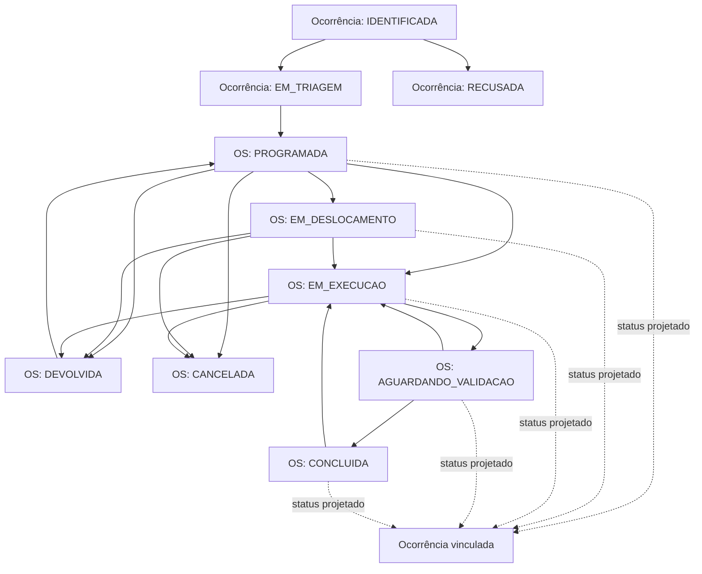

# Auditoria inicial — estabilização P0 e evolução P1

> Realizada em 2 de outubro de 2026, antes de alterações de código desta evolução. A análise considera código, migrations, documentos e testes existentes.

## Linha de base

| Verificação | Resultado |
| --- | --- |
| `npm.cmd test` | 31 testes aprovados |
| `npm.cmd run build` | TypeScript e build aprovados; bundle inicial JavaScript de 584,21 kB minificado |
| `npm.cmd run test:ui` | Aprovado em desktop e celular, sem erros de console |
| `npm.cmd run test:field` | Aprovado, incluindo rascunho, reenvio e atribuição individual |
| `npm.cmd run test:kanban` | Aprovado, incluindo arraste, toque, teclado, WIP e navegação agrupada |

Os testes usam bancos temporários. A linha de base confirma os fluxos atuais, mas não valida PostgreSQL/PostGIS em uma instância real nem carga de produção.

## Como o domínio funciona de fato

O banco armazena `status` tanto em `occurrences` quanto em `orders`.

- A ocorrência nasce em `IDENTIFICADA`, pode ir para `EM_TRIAGEM` ou `RECUSADA`.
- A OS só pode ser criada a partir de ocorrência em `EM_TRIAGEM` e nasce em `PROGRAMADA`.
- Ao criar ou alterar a OS, `propagate` copia o status da OS para as ocorrências vinculadas. Portanto uma ocorrência vinculada pode exibir estados de atendimento, embora a transição seja controlada pela OS.
- Uma ocorrência pode estar vinculada a mais de uma OS. Quando uma OS é encerrada, a propagação mantém o status de outra OS ainda ativa.
- `action_plans` são planejamento operacional; não são uma obra nem uma intervenção e não devem ser convertidos automaticamente.

O modelo atual tem um ciclo de decisão da ocorrência e um ciclo de execução da OS, com uma projeção do segundo sobre a ocorrência. A state machine canônica deve preservar isso, em vez de tratar todos os estados como se fossem transições diretas de ambas as entidades.

## Achados

| Severidade | Achado | Impacto | Evidência |
| --- | --- | --- | --- |
| HIGH | Não há optimistic locking em ocorrências, OS ou planos. | Duas telas podem gravar dados derivados de uma versão antiga; a fila serial só protege um processo, não a intenção do usuário nem múltiplas instâncias. | Atualizações usam `WHERE id=?` em `server/app.js`; não há coluna `version`. |
| HIGH | As listagens de ocorrências e OS carregam todos os registros e filtram principalmente em memória. | Crescimento de dados aumenta transferência, memória, tempo de resposta e torna a filtragem no React insuficiente. | `listOccurrences`, `/api/ordens-servico` e `src/main.tsx`. |
| HIGH | Não existe contrato único para estados e transições. | Risco de divergência entre rotas, Kanban, telas e documentos ao evoluir o fluxo. | Strings aparecem em `server/app.js`, `server/domain.js`, `server/planning.js`, `server/kanban.js`, `src/*` e documentos. |
| HIGH | Arquivos dependem diretamente de `multer.diskStorage` em mais de um módulo. | Não há troca segura para armazenamento de objeto; regras de arquivo e limpeza ficam dispersas. | `server/app.js` e `server/invoices.js`. |
| MEDIUM | `GET /api/auditoria` tem limite fixo de 300 e não possui filtros. | Auditoria perde utilidade operacional à medida que cresce e não pode servir o histórico pesquisável por entidade. | `server/app.js`. |
| MEDIUM | PostgreSQL/PostGIS existe no adaptador, mas não possui teste de integração nem matriz de compatibilidade. | O alvo de produção ainda não está homologado. | `server/db.js`, documentação de implantação e testes atuais. |
| MEDIUM | Migrations 2 a 4 são aditivas e transacionais, mas ficam embutidas em `server/db.js`; a documentação de implantação ainda cita somente 2 e 3. | A operação pode não reconhecer a migration 4; manutenção das migrations ficará difícil ao crescer. | `server/db.js`, `docs/DEPLOYMENT.md`. |
| MEDIUM | `src/main.tsx` tem 3.457 linhas e `server/app.js` 1.310 linhas. | Aumenta risco de regressão e custo de evolução; exige modularização gradual. | Medição da base atual. |
| MEDIUM | Mapa, proximidade e dashboard ainda podem buscar conjuntos completos. | Consultas espaciais e painéis não escalarão para um município inteiro sem bounds/consultas agregadas. | `/api/mapa/ocorrencias`, `/api/ocorrencias/proximas` e `/api/dashboard`. |
| LOW | A documentação diverge do código em pontos de planejamento e migrations. | Pode induzir integrações ou operação incorretas, embora não quebre o fluxo. | `docs/API.md` exige 2 demandas em plano; código atual aceita 1. `docs/DEPLOYMENT.md` não cita migration 4. |
| LOW | O bundle inicial excede o alerta de 500 kB. | Afeta carregamento inicial, sobretudo em redes móveis lentas. | Build de linha de base: 584,21 kB minificado. |

Não foi identificado BLOCKER ou CRITICAL nos fluxos cobertos pela linha de base.

## Regras que devem ser preservadas

- Registro e prevenção consciente de duplicidade, inclusive idempotência de campo.
- Triagem, recusa justificada e programação integrada com rollback.
- Compatibilidade entre ocorrência, setor, equipe e operador.
- Exigências de evidência/material por categoria.
- Devolução, reprogramação, validação, reabertura e cancelamento justificados.
- Auditoria, permissões de servidor, sessão, origem, anexos autenticados e transações.
- Planejamento por via, Kanban com WIP e ordenação compartilhada.
- Rascunhos locais e Web Push.

## Arquivos inicialmente afetados

| Etapa | Arquivos principais |
| --- | --- |
| P0.1–P0.2 | `server/domain.js` ou novo `server/domain/workflow.js`, `server/app.js`, `server/kanban.js`, `shared/*`, documentação e testes. |
| P0.3–P0.4 | `server/db.js`, `server/schema.sql`, `server/app.js`, `server/planning.js`, `src/main.tsx`, `src/Operator.tsx`, testes. |
| P0.5–P0.6, P0.10 | `server/app.js`, `server/audit*` quando extraído, `src/main.tsx`, testes e índices. |
| P0.7–P0.9 | `server/db.js`, adaptador, storage novo, `server/app.js`, `server/invoices.js`, testes e implantação. |
| P0.11–P0.13 | módulos incrementais de front-end e back-end; sem reescrever fluxos. |
| P1 | novas migrations, módulos de obras/intervenções/vias/capacidade, mapa, planejamento, API, telas, documentação e testes. |

## Plano de migrations

As migrations existentes são: 1 (schema base), 2 (planos de ação), 3 (idempotência e push) e 4 (notas/inventário). Elas não devem ser alteradas.

| Versão proposta | Conteúdo | Estratégia de compatibilidade |
| --- | --- | --- |
| 5 | `version INTEGER NOT NULL DEFAULT 1` em ocorrências, OS e planos; índices para filtros e auditoria. | Aditiva; registros existentes recebem `1`. |
| 6 | Entidades P1: obras, intervenções, vínculos opcionais, geometria GeoJSON, segmentos viários e capacidade de equipe. | Novos campos anuláveis e tabelas independentes; OS e ocorrências seguem funcionando sem relação P1. |
| 7 | Limites Kanban por escopo, caso a modelagem confirmada exija tabela própria em vez de `settings`. | Migração explícita da configuração global existente, com fallback seguro. |

A numeração será confirmada imediatamente antes de cada implementação, para evitar colisão com migrations adicionadas em paralelo. Cada migration será transacional quando o banco permitir e registrada em `schema_migrations` somente após sucesso.

## Sequência de execução recomendada

1. Centralizar state machine e documentar o modelo real de ocorrência/OS.
2. Introduzir versões e conflitos 409, preservando formulários locais para atualização segura.
3. Paginar e filtrar no servidor ocorrências, OS e auditoria, mantendo compatibilidade temporária da resposta onde necessário.
4. Extrair armazenamento local por interface e validar SQLite/PostgreSQL/PostGIS.
5. Extrair módulos de ocorrência e OS do monólito e telas pesadas por carregamento sob demanda.
6. Criar P1 em paralelo ao fluxo existente: obra, intervenção, via, geometria e capacidade, todos opcionais.
7. Evoluir mapa, planejamento e WIP por escopo somente após o modelo P1 estar testado.

## Critérios para iniciar a implementação

Esta auditoria conclui a Etapa 1 do pedido. A implementação deve começar pela state machine, com testes de transição válidos e inválidos, sem mudar silenciosamente os status armazenados ou os fluxos de ocorrência já existentes.

