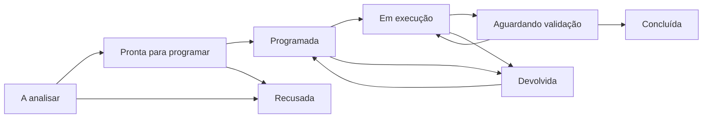

# Fluxo de demandas

O percurso diário tem quatro decisões: analisar a demanda, programar o atendimento, executar o serviço e conferir o resultado para encerrar. O Planejamento ajuda a escolher intervenções e agrupar demandas da mesma via; não é uma etapa obrigatória para atender um chamado.

## Fonte única do fluxo

O código canônico está em `server/domain/workflow.js`. A ocorrência passa de **A analisar** (`IDENTIFICADA`) para **Pronta para programar** (`EM_TRIAGEM`) ou é recusada. A OS então percorre programação, deslocamento, execução, validação, devolução, conclusão ou cancelamento. A ocorrência vinculada acompanha o status da OS para que a pessoa usuária veja o atendimento no mesmo registro.

## Problemas corrigidos

- A triagem concluída continuava exibida como “Em triagem”. A interface agora identifica essa situação como “Pronta para programar”, preservando o código interno e os registros existentes.
- A gestão precisava entrar na programação para avançar, sem uma ação explícita para guardar a análise. Agora pode concluir a triagem e programar depois.
- Triagem e programação apareciam simultaneamente. Agora apenas a decisão em andamento permanece aberta; é possível voltar sem perder os dados digitados.
- O contexto operacional ocupava o formulário antes da escolha de equipe. Agora é uma consulta opcional, mantendo a carga real e os compromissos por data disponíveis.
- Uma falha de atualização após cadastrar podia parecer falha de gravação. Agora a confirmação do registro antecede a atualização, evitando induzir nova submissão.
- O Planejamento misturava demandas já reservadas e novos candidatos. Agora exclui reservas e atendimentos existentes, separa setores e permite planejar uma intervenção isolada.
- A escolha considera urgência, prazo original, idade e volume. A prioridade sugerida fica explícita, e a emissão de plano e ordem juntos é atômica: falhas não deixam reservas incompletas.
- As abas de planejamento respondem a setas, Home e End; listas respondem a Enter e Espaço. O foco de teclado é visível, e as filas de triagem usam botões com estado selecionado e contagens.

## Uso recomendado

1. Em Triagem, abrir “A analisar”, conferir categoria, prioridade e setor. Programar diretamente ou concluir a triagem para depois.
2. Em “Prontas para programar”, escolher equipe, responsável e data. Consultar os trabalhos do setor quando necessário.
3. Usar Planejamento para comparar obras, selecionar demandas disponíveis e preparar um plano ou emitir sua ordem imediatamente. Demandas sem triagem podem compor um plano, mas precisam ser analisadas antes da programação.
4. A equipe executa pela interface de campo, registra os materiais e as evidências exigidas e envia o resultado para conferência.
5. A gestão ou fiscalização aprova e encerra, solicita correção ou reprograma uma devolução com justificativa.

Os testes automatizados cobrem regras, persistência, permissões, rollback, teclado, toque e percursos em desktop e celular. Isso não substitui uma avaliação com usuários reais ou uma auditoria completa de acessibilidade com tecnologias assistivas.
